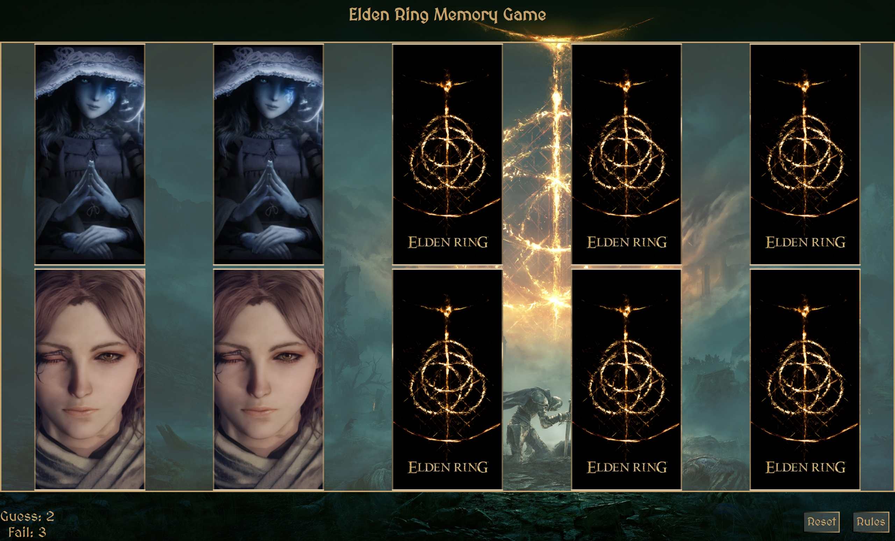

# Elden Ring Memory Game

The Elden Ring memory game is inspired by its original version of the game called "_**Elden Ring**_" developed from "**_From Software_**", therefore all rights go to the video game development company. The concept of this game is designed for children but fun for all ages.
The game is composed of cards which make up the game-board where the player will play.
Using cognitive memory skills, the player flips the cards until all the matches are found.
Being primarily inspired by the games from "**_From Software_**", I personalized the memory by adding the chance to lose the game when a certain amount of fails is reached.

## Features

- __Fourteen clickable cards__

  - The square game-board is made up of a total of 10 cards that will flip 180° when clicked.
  - The front face of each card is representing a character in the official "_**Elden Ring**_" game.
  - The back face of all cards is the same, depicting the logo of the original game "_**Elden Ring**_". 

Ps: the images are aligned intentionally as follows for the purpose of the screenshot.

If all matches are made, the game board will display that the player has won the game.
The "_**Reset**_" button is always clickable at anytime during the game, as well as the "_**Rules**_" button.

If no match is found, both cards will flip back over and remain clickable for future guesses, also if the player keeps guessing the wrong card, the game will end, and the game board will display that the player has lost the game.

---

- __Two clickable buttons__

  - "_**Reset**_" Button - The reset button will flip all cards back over so the back face / cover of the card is showing. The cards will be then randomized and the two counters will be reset to zero.
  - "_**Rules**_" Button - When the rules button is clicked, a responsive message will appear with the rules and the benefits of the game. To return to the game-board and play the game, the player will need to click the "_**Hide**_" button.

### Features Left to Implement

- Adding some sound effects to each card when the card is flipped and there is a match and when there is not, plus a background music to indicate that the game has started.

- Animation effect when the player wins / lose.

- To further increase difficulty, levels could be incorporated to encourage older or more advanced users to play. By adding two or four more pairs, the game could take on a higher skill level.

- A timer could also clock the player's score, encouraging the player to beat their time in each round.

- Incorporating a "high scores" page would increase interest in the game.

### Bugs Encountered

- To my knowledge there are no major unfixed bugs. The game run and does exactly what it is supposed to do.
- I initially encountered a problem in showing the images on GitHub pages, although they were perfectly displayed on localhost, they still couldn't be seen and the cards were left totally blank.
I then address the problem just by playing with the file path inside my array of cards created in JavaScript, and it worked.

#### Unresolved issue

- When trying to shrink the game window manually to other dimensions, the design might look like broken.
In order to resolve this problem, simply click the - "_**Reset**_" button on the bottom of the page.
If the problem still persists, refresh the page at the desired responsive dimension. 

## Testing
- The website itself was tested on Chrome, Safari and Firefox web browsers using a laptop computer. It was also designed to be responsive on a range of devices, using the Responsive setting on Chrome DevTools to simulate sizes.

- To complete my testing phase, I ran it through Lighthouse in Chrome DevTools, both desktop, and mobile versions.
- Due to some Google Chrome extensions, the tests were performed in Incognito Mode.
  The results are below:

Homepage (desktop)

Homepage (mobile)

---
### Validator Testing

#### HTML - test result
- No errors were found when the code was passed through the official [W3C validator](https://validator.w3.org/). This was tested individually on each page.

---

#### CSS - test result
- The only error found during the validation, has to do with the fact that I used CSS variables in my code. Overall there are no mayor warnings when passing through the official [(Jigsaw) validator](https://jigsaw.w3.org/css-validator/)

---

#### JavaScript - test result
  - No errors were found in the JavaScript file when it was run through the [(JShint) validator](https://jshint.com/) but there were warnings, an excerpt of which is shown in the first screenshot below.

---

## Deployment

I deployed this website to GitHub pages on the GitHub hosting platform following the steps below:

- Once in my personal GitHub repository for this project, I clicked the Settings button. From there I clicked "**Pages**" from the left side menu.
- Next under "**_Source_**" I selected the main branch,  refreshed the page and a link to the live site was provided, indicating successful deployment.

The live link can be found here - https://sebhd1.github.io/elden-ring-memory-game/

### To Fork the Repository

To make a copy or ‘fork’ the repository

- Log into GitHub and locate repository
- On the right hand side of the page select the ‘fork’ option to create and copy of the original

### To create a Local Clone

1. under the repository name, click on the ‘code’ tab
2. in the clone box, HTTPS tab, click on the clipboard icon
3. in your IDE open GitBash
4. Changed the current working directory to the location you want the cloned directory to be made
5. Type ‘git clone’ and then paste the URL copied from GitHub
6. press enter and the local clone will be created

---
---
## Credits

### Content

- The Layout inspiration for the game and the colors pattern were taken from [eldenring.wiki.fextralife.com](https://eldenring.wiki.fextralife.com/Elden+Ring+Wiki)

- I used fonts from [Google Fonts](https://fonts.google.com/) for this project.

- I used Stack Overflow for general troubleshooting and issues with grid spacing.

- Information for the landing page overlay, "Benefits of the game" was taken from the [Walnut Montessori-Preschool Academy](https://www.walnutmontessori-preschool.com/why-kids-should-play-memory) website.

- Feedback and comments from the reviewer of my PP1 were taken into account for this project when running tests and identifying and fixing bugs.

- The pictures used for the cards were taken from the official Elden Ring Wiki - [eldenring.wiki.fextralife.com](https://eldenring.wiki.fextralife.com/Elden+Ring+Wiki)

### Acknowledgements
This website was executed and completed as a portfolio 2 Project for the full stack diploma at [Code Institute](https://codeinstitute.net/).

Sebastiano Ballotta, 2022.